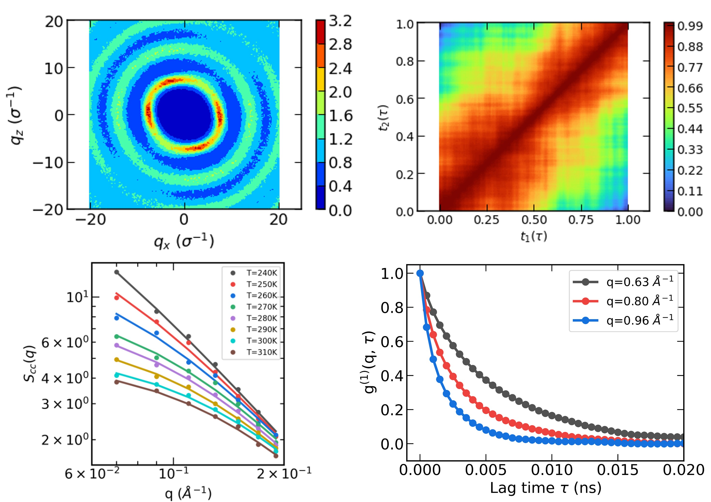

# FLAMES—Fast, Low-storage, Accurate,  and Memory-Efficient adaptive Sampling—Approach to Resolve Spatially Dependent Dynamics of Molecular Liquids

    

Types of work can be done:
- calculation of structure factors that can also be obtained by experiments (e.g., SAXS/SANS)
- calculation of the partial structure factors that can be used to study critical phenomena
- calculation of the intermediate scattering function (ISF) and g1/g2 correlation function that can be probed by x-ray photon correlation spectroscopy (XPCS)
- calculation of the two-time correlation function c2 for nonequilibrium molecular dynamics

## Prerequisites
Main packages used:
- [MDAnalysis](https://www.mdanalysis.org/) file IO (tested v2.4.3)
- [numba](https://numba.pydata.org/) accelerated array processing (tested v0.51.2)
- [scipy](https://scipy.org/) autocorrelation function calculation (tested 1.8.1)
- [numpy](https://numpy.org/) array processing (tested 1.22.4)

Packages used with modification (no need to install):
- [dynasor](https://dynasor.materialsmodeling.org/) q-points generation and density calculation

## How to use
Set the control parameters and run the script under the environment with above packages:
> python main_test.py

Note that the current test is on the Gromacs xtc trajectory (e.g., time and length unit in ps and nm). For other types of trajectories, especially saved in LJ units, the unit conversion must be done correctly!

## How to cite
G. Chen, S. Narayanan, G. B. Stephenson, M. J. Servis, S. K.R.S. Sankaranarayanan. "FLAMES—Fast, Low-storage, Accurate, and Memory-Efficient adaptive Sampling—Approach to Resolve Spatially Dependent Dynamics of Molecular Liquids". Submitted. 
