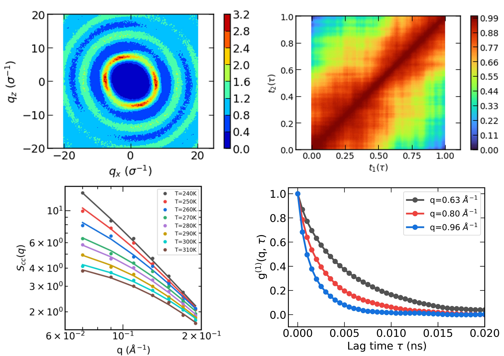

# FLAMES—Fast, Low-storage, Accurate,  and Memory-Efficient adaptive Sampling—Approach to Resolve Spatially Dependent Dynamics of Molecular Liquids

    

Types of work can be done*:
- calculation of structure factors that can also be obtained by experiments (e.g., SAXS/SANS)
- calculation of the partial structure factors that can be used to study critical phenomena
- calculation of the intermediate scattering function (ISF) and g1/g2 correlation function that can be probed by x-ray photon correlation spectroscopy (XPCS)
- calculation of the two-time correlation function c2 for nonequilibrium molecular dynamics
  
*Not all added yet. Will keep updating once new research is published.

## Prerequisites
Main packages used are included in the requirements.txt file.

## How to use
First and foremost, change into the python environment with above packages. 
### GUI version
> streamlit run app.py

### Reproduce the FLAMES paper
Set the control parameters and run the script:
> cd tests/
> 
> python jctc25_test.py

Note that the current test is on the Gromacs xtc trajectory (e.g., time and length unit in ps and nm). For other types of trajectories, especially saved in xtc format with LJ units, the unit conversion must be done correctly!

## How to cite
G. Chen, S. Narayanan, G. B. Stephenson, M. J. Servis, S. K.R.S. Sankaranarayanan. "FLAMES—Fast, Low-storage, Accurate, and Memory-Efficient adaptive Sampling—Approach to Resolve Spatially Dependent Dynamics of Molecular Liquids". Journal of Chemical Theory and Computation 21.18 (2025): 8661-8668.

